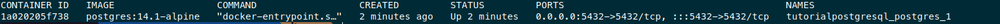
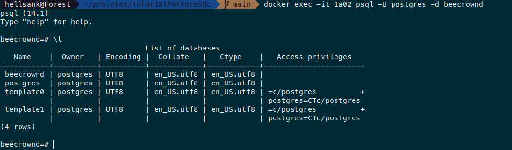

# Mini tutorial de docker

## Instalando o Dockerzitos

### Instalando via APT

```
$ sudo apt install docker
$ sudo apt install docker-compose
```

Adicionando o seu usuário ao grupo do Docker. Por que executar este
comando ? Caso este passo não seja feito então toda vez que você
for executar algum comando do docker será necessária permissão de
super usuário.

```
$ sudo usermod -aG docker ${USER}
$ su -${USER}
```
Reinicie sua máquina, se tudo tiver ocorrido como esperado será 
possível executar o container.

## Rodando o container

Na pasta do projeto execute o comando:
```
$ docker-compose up -d
```

Liste os containers em atividade com o comando:
```
$ docker ps
```



## Entrando no container

Cada container ativo possui um ID, uma das maneiras de entrar 
no container é através do CONTAINER ID. Nosso interesse é chegar
até a linha de comando do postgres, para isto executaremos o comando:

```
$ docker exec -it CONTAINER_ID psql -U postgres -d beecrownd
```

Se o comando foi executado com sucesso você chegou à linha de comando
do postgres e já está conectado ao banco de dados chamado 
**beecrowd**, que será o usado para realizar os exercícios.



## Referências

1. [Linux Tips, Docker 2022](https://www.youtube.com/watch?v=MeFyp4VnNx0&ab_channel=LINUXtips)

1. [Digital Ocean](https://www.digitalocean.com/community/tutorials/how-to-install-and-use-docker-on-ubuntu-20-04).

1. [Volumes em docker-compose](https://docs.docker.com/storage/volumes/)
