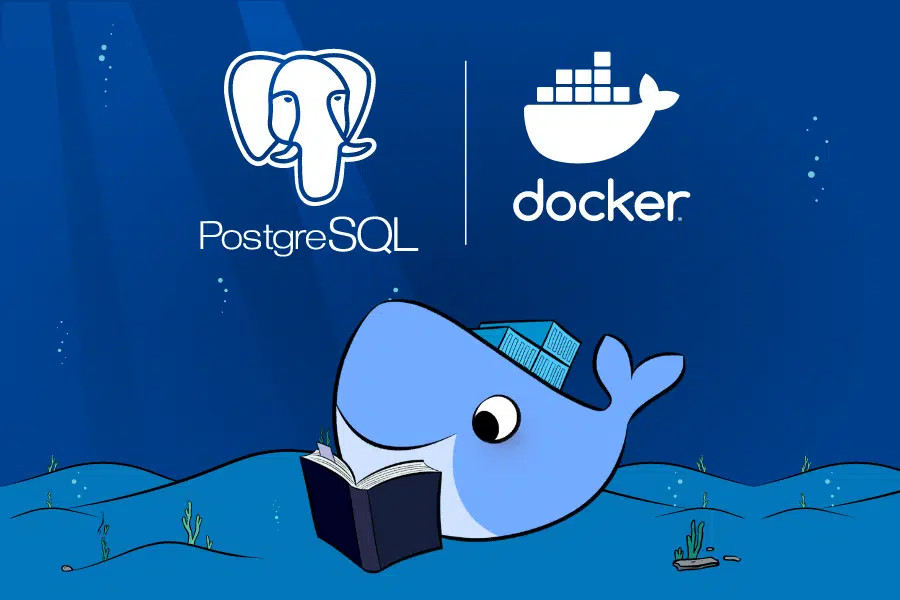

# TutorialPostgreSQL

Imagem obtida em: [Why should you containerize Postgres?](https://www.docker.com/blog/how-to-use-the-postgres-docker-official-image/)

Este repositório está focado em criar exercícios sobre funções
e procedures na linguagem PL/pgsql. Os desafios foram criados pensando na
utilização de um container definido pelo [docker-compose.yml](docker-compose.yml) do repositório, caso não esteja
familiarizado com containers considere ler o arquivo [DOCKER.md](DOCKER.md).

## Por que aprender PL/pgsql ?

Boa parte dos problemas relacionados aos bancos de dados são sobre a integridade dos dados armazenados, atitudes como a normalização
do banco, definição coerente do domínio de cada atributo das tabelas são um bom começo para armazenar corretamente dados que representem
bem sua abstração do mundo real. Entretanto, nem sempre é possível representar bem suas regras de negócio em bases de dados usando apenas
restrições de [integridade](http://www.bosontreinamentos.com.br/modelagem-de-dados/modelagem-de-dados-restricoes-de-integridade/).

Sendo assim, aqui estão alguns motivos para se usar uma linguagem procedural que atua diretamente na base de dados.

- O uso de restrições de integridade não são suficientes para validar os dados presentes no banco.
- Existe mais de um software que acessa a base (exemplo: um app de celular e um servidor django), se as validações forem feitas na base as
aplicações não precisarão de se preocuparem com isso.
- Maior segurança nos dados presentes, se as validações forem feitas apenas na aplicação e alguém tiver acesso direto ao banco então
esta pessoa pode inserir ou retirar dados de maneira a ferir sua regra de negócios.
- Realização de auditoria, neste processo geralmente são criadas tabelas, que apenas o DBA ou um grupo restrito de usuários possui acesso,
que armazenam alterações e outras ações relevantes, para armazenar estes dados geralmente são criadas triggers e storage procedures.
- Em Orientação a Objetos existe o conceito de herança, para armazenar classes que herdam dados de outras é possível fazer este controle 
através da linguagem procedural.

Independente do motivo pelo qual vossa mercê esteja aqui, se divirta com os exercícios e seja bem vindo(a).
